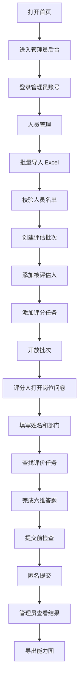

# 人工流程测试报告

测试时间：2026-09-09（Asia/Shanghai）

## 一、测试范围

本次按“纯人工操作流程”验证了以下完整链路：

人员导入 → 创建批次 → 配置被评估人/评分人 → 开放批次 → 评分人填写问卷 → 结果汇总 → 导出能力图。

## 二、测试数据

第一批为销售岗位，因销售岗位已有开放批次，为避免影响现有数据，最终正式答题验证改在商务岗位完成。

模拟人员：

| 姓名 | 部门 | 职位 |
| --- | --- | --- |
| 赵测试 | 商务一部 | 商务 |
| 钱测试 | 商务二部 | 商务 |
| 孙测试 | 商务三部 | 商务 |

测试批次：纯人工流程测试-商务-1536  
被评估人：赵测试  
评分人：钱测试（上级）、孙测试（平级）  
评分结果：六维全部 3.00，有效评分人数 2。

## 三、流程可视化

## 四、测试结果

- Excel 导入：3 名模拟人员导入成功。
- 批次创建与开放：成功。
- 问卷填写与提交：2 名评分人均提交成功。
- 结果汇总：六维完整，生成能力图。
- 能力图导出：PNG 导出成功。

导出的能力图：

- [人工流程测试-商务能力图.png](./人工流程测试-商务能力图.png)
